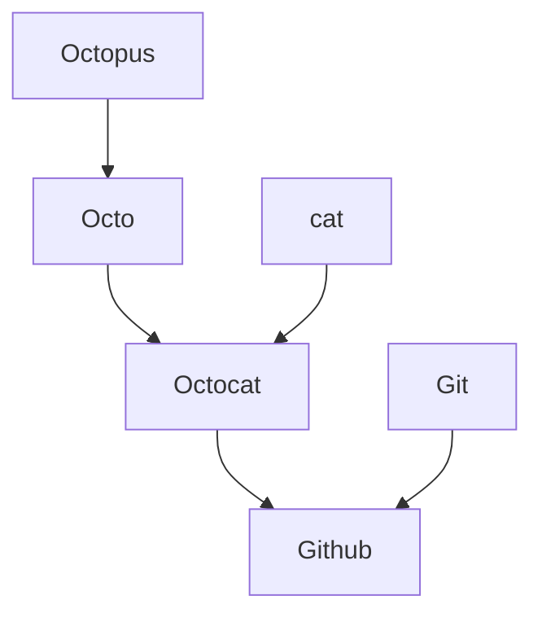

# github-course-intro
Introduction to Git and Github
## About Me
I am learning GitHub.
## Beautify
> [!TIP]
> To add emojis, type `:EMOJICODE:`
> ``` python
> print(":octocat:")
> ```

<details>

<summary>Collapsed section</summary>

### Collection of octocat
:octocat: :octocat: :octocat: :octocat: :octocat: :octocat:

:octocat: :octocat: :octocat: :octocat: :octocat: :octocat: :octocat:

[List of available emojis](https://github.com/ikatyang/emoji-cheat-sheet/blob/github-actions-auto-update/README.md)

</details>

### Sample Mermaid diagram



> [!NOTE]
> :copilot: _**Copilot**_
